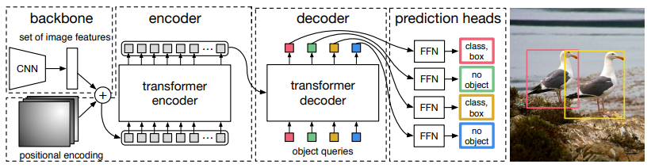

# DETR

DETR (aka DEtection TRansformers) solve object detection using transformers and CNNs. As compared to other object detection models, DETR looks at the image once. This model is simple and doesn't require a lot of preprocessing.



## Encoder Decoder Architecture

DETR is made up of 2 parts:

1. Encoder
2. Decoder

### Encoder

Encoder is a standard transformer network that use self-attention. Here, each part of the image looks at every other part. This brings out the correlations between different parts of the image and highlights the most important features.

### Decoder

Decoder uses general attention where the key and value are from the encoder. The query in this is provided separately. We use the query to find the best values in the key. The query here is a bounding box.

## Bipartite Loss

This is used to match multiple bounding box to a single ground truth box. Using this, we reduce the number of insignificant predictions. This loss is based on the Hungarian Algorithm.

## Object Queries

1 Object query ask "questions" about a single part of the image. DETR uses multiple part of the queries to identify the object and predict the bounding box coordinates for it.

## Logs

[colab notebook](https://colab.research.google.com/drive/1SEOG0mz5lakmCzmaahMvRvm4OnR6J2z9?usp=sharing)

```
Not using distributed mode
git:
  sha: e42a3b174d2325c28f82d7114138c755ac7c095a, status: clean, branch: finetune

Namespace(aux_loss=True, backbone='resnet50', batch_size=2, bbox_loss_coef=5, clip_max_norm=0.1, coco_panoptic_path=None, coco_path='/content/data/custom/', dataset_file='custom', dec_layers=6, device='cuda', dice_loss_coef=1, dilation=False, dim_feedforward=2048, dist_url='env://', distributed=False, dropout=0.1, enc_layers=6, eos_coef=0.1, epochs=10, eval=False, frozen_weights=None, giou_loss_coef=2, hidden_dim=256, lr=0.0001, lr_backbone=1e-05, lr_drop=200, mask_loss_coef=1, masks=False, nheads=8, num_classes=2, num_queries=100, num_workers=2, output_dir='outputs', position_embedding='sine', pre_norm=False, remove_difficult=False, resume='detr-r50_no-class-head.pth', seed=42, set_cost_bbox=5, set_cost_class=1, set_cost_giou=2, start_epoch=0, weight_decay=0.0001, world_size=1)
number of params: 41279495
loading annotations into memory...
Done (t=0.00s)
creating index...
index created!
loading annotations into memory...
Done (t=0.00s)
creating index...
index created!
Start training
.
.
.
.

Epoch: [9]  [ 0/30]  eta: 0:00:24  lr: 0.000100  class_error: 14.29  loss: 6.4573 (6.4573)  loss_ce: 0.1517 (0.1517)  loss_bbox: 0.2672 (0.2672)  loss_giou: 0.6499 (0.6499)  loss_ce_0: 0.1486 (0.1486)  loss_bbox_0: 0.2971 (0.2971)  loss_giou_0: 0.6005 (0.6005)  loss_ce_1: 0.1070 (0.1070)  loss_bbox_1: 0.3226 (0.3226)  loss_giou_1: 0.6790 (0.6790)  loss_ce_2: 0.0660 (0.0660)  loss_bbox_2: 0.3399 (0.3399)  loss_giou_2: 0.6851 (0.6851)  loss_ce_3: 0.0329 (0.0329)  loss_bbox_3: 0.3376 (0.3376)  loss_giou_3: 0.7068 (0.7068)  loss_ce_4: 0.1522 (0.1522)  loss_bbox_4: 0.2743 (0.2743)  loss_giou_4: 0.6388 (0.6388)  loss_ce_unscaled: 0.1517 (0.1517)  class_error_unscaled: 14.2857 (14.2857)  loss_bbox_unscaled: 0.0534 (0.0534)  loss_giou_unscaled: 0.3249 (0.3249)  cardinality_error_unscaled: 0.0000 (0.0000)  loss_ce_0_unscaled: 0.1486 (0.1486)  loss_bbox_0_unscaled: 0.0594 (0.0594)  loss_giou_0_unscaled: 0.3002 (0.3002)  cardinality_error_0_unscaled: 5.0000 (5.0000)  loss_ce_1_unscaled: 0.1070 (0.1070)  loss_bbox_1_unscaled: 0.0645 (0.0645)  loss_giou_1_unscaled: 0.3395 (0.3395)  cardinality_error_1_unscaled: 5.0000 (5.0000)  loss_ce_2_unscaled: 0.0660 (0.0660)  loss_bbox_2_unscaled: 0.0680 (0.0680)  loss_giou_2_unscaled: 0.3426 (0.3426)  cardinality_error_2_unscaled: 3.0000 (3.0000)  loss_ce_3_unscaled: 0.0329 (0.0329)  loss_bbox_3_unscaled: 0.0675 (0.0675)  loss_giou_3_unscaled: 0.3534 (0.3534)  cardinality_error_3_unscaled: 0.0000 (0.0000)  loss_ce_4_unscaled: 0.1522 (0.1522)  loss_bbox_4_unscaled: 0.0549 (0.0549)  loss_giou_4_unscaled: 0.3194 (0.3194)  cardinality_error_4_unscaled: 0.0000 (0.0000)  time: 0.8242  data: 0.3564  max mem: 4392
Epoch: [9]  [10/30]  eta: 0:00:07  lr: 0.000100  class_error: 0.00  loss: 3.0134 (3.3381)  loss_ce: 0.0186 (0.0495)  loss_bbox: 0.1615 (0.1787)  loss_giou: 0.2708 (0.2881)  loss_ce_0: 0.1438 (0.1431)  loss_bbox_0: 0.1779 (0.2091)  loss_giou_0: 0.2637 (0.3148)  loss_ce_1: 0.0680 (0.0766)  loss_bbox_1: 0.1749 (0.1892)  loss_giou_1: 0.2739 (0.2840)  loss_ce_2: 0.0440 (0.0577)  loss_bbox_2: 0.1738 (0.1854)  loss_giou_2: 0.2600 (0.3010)  loss_ce_3: 0.0294 (0.0458)  loss_bbox_3: 0.1801 (0.1924)  loss_giou_3: 0.2969 (0.3039)  loss_ce_4: 0.0246 (0.0483)  loss_bbox_4: 0.1595 (0.1793)  loss_giou_4: 0.2722 (0.2913)  loss_ce_unscaled: 0.0186 (0.0495)  class_error_unscaled: 0.0000 (4.3290)  loss_bbox_unscaled: 0.0323 (0.0357)  loss_giou_unscaled: 0.1354 (0.1441)  cardinality_error_unscaled: 0.0000 (0.1364)  loss_ce_0_unscaled: 0.1438 (0.1431)  loss_bbox_0_unscaled: 0.0356 (0.0418)  loss_giou_0_unscaled: 0.1318 (0.1574)  cardinality_error_0_unscaled: 2.0000 (2.2727)  loss_ce_1_unscaled: 0.0680 (0.0766)  loss_bbox_1_unscaled: 0.0350 (0.0378)  loss_giou_1_unscaled: 0.1370 (0.1420)  cardinality_error_1_unscaled: 0.5000 (1.0000)  loss_ce_2_unscaled: 0.0440 (0.0577)  loss_bbox_2_unscaled: 0.0348 (0.0371)  loss_giou_2_unscaled: 0.1300 (0.1505)  cardinality_error_2_unscaled: 0.0000 (0.3182)  loss_ce_3_unscaled: 0.0294 (0.0458)  loss_bbox_3_unscaled: 0.0360 (0.0385)  loss_giou_3_unscaled: 0.1485 (0.1519)  cardinality_error_3_unscaled: 0.0000 (0.0909)  loss_ce_4_unscaled: 0.0246 (0.0483)  loss_bbox_4_unscaled: 0.0319 (0.0359)  loss_giou_4_unscaled: 0.1361 (0.1457)  cardinality_error_4_unscaled: 0.0000 (0.1364)  time: 0.3506  data: 0.0433  max mem: 4392
Epoch: [9]  [20/30]  eta: 0:00:03  lr: 0.000100  class_error: 13.33  loss: 3.5977 (3.7395)  loss_ce: 0.0317 (0.0783)  loss_bbox: 0.1592 (0.1692)  loss_giou: 0.2780 (0.3258)  loss_ce_0: 0.1680 (0.1974)  loss_bbox_0: 0.1750 (0.2052)  loss_giou_0: 0.3363 (0.3618)  loss_ce_1: 0.0797 (0.1273)  loss_bbox_1: 0.1657 (0.1876)  loss_giou_1: 0.2924 (0.3308)  loss_ce_2: 0.0458 (0.0942)  loss_bbox_2: 0.1619 (0.1780)  loss_giou_2: 0.2896 (0.3293)  loss_ce_3: 0.0386 (0.0823)  loss_bbox_3: 0.1596 (0.1767)  loss_giou_3: 0.2952 (0.3288)  loss_ce_4: 0.0349 (0.0787)  loss_bbox_4: 0.1553 (0.1685)  loss_giou_4: 0.2772 (0.3197)  loss_ce_unscaled: 0.0317 (0.0783)  class_error_unscaled: 0.0000 (5.0121)  loss_bbox_unscaled: 0.0318 (0.0338)  loss_giou_unscaled: 0.1390 (0.1629)  cardinality_error_unscaled: 0.5000 (0.9524)  loss_ce_0_unscaled: 0.1680 (0.1974)  loss_bbox_0_unscaled: 0.0350 (0.0410)  loss_giou_0_unscaled: 0.1682 (0.1809)  cardinality_error_0_unscaled: 3.0000 (6.5952)  loss_ce_1_unscaled: 0.0797 (0.1273)  loss_bbox_1_unscaled: 0.0331 (0.0375)  loss_giou_1_unscaled: 0.1462 (0.1654)  cardinality_error_1_unscaled: 1.0000 (3.9524)  loss_ce_2_unscaled: 0.0458 (0.0942)  loss_bbox_2_unscaled: 0.0324 (0.0356)  loss_giou_2_unscaled: 0.1448 (0.1646)  cardinality_error_2_unscaled: 0.0000 (1.8810)  loss_ce_3_unscaled: 0.0386 (0.0823)  loss_bbox_3_unscaled: 0.0319 (0.0353)  loss_giou_3_unscaled: 0.1476 (0.1644)  cardinality_error_3_unscaled: 0.0000 (1.1905)  loss_ce_4_unscaled: 0.0349 (0.0787)  loss_bbox_4_unscaled: 0.0311 (0.0337)  loss_giou_4_unscaled: 0.1386 (0.1599)  cardinality_error_4_unscaled: 0.5000 (1.0952)  time: 0.2918  data: 0.0107  max mem: 4392
Epoch: [9]  [29/30]  eta: 0:00:00  lr: 0.000100  class_error: 0.00  loss: 3.5310 (3.5103)  loss_ce: 0.0340 (0.0650)  loss_bbox: 0.1583 (0.1671)  loss_giou: 0.2690 (0.3026)  loss_ce_0: 0.1947 (0.1810)  loss_bbox_0: 0.1731 (0.1978)  loss_giou_0: 0.3407 (0.3446)  loss_ce_1: 0.1029 (0.1170)  loss_bbox_1: 0.1497 (0.1817)  loss_giou_1: 0.2987 (0.3096)  loss_ce_2: 0.0531 (0.0829)  loss_bbox_2: 0.1496 (0.1716)  loss_giou_2: 0.2725 (0.3112)  loss_ce_3: 0.0395 (0.0706)  loss_bbox_3: 0.1618 (0.1730)  loss_giou_3: 0.2761 (0.3076)  loss_ce_4: 0.0367 (0.0664)  loss_bbox_4: 0.1383 (0.1637)  loss_giou_4: 0.2761 (0.2971)  loss_ce_unscaled: 0.0340 (0.0650)  class_error_unscaled: 0.0000 (3.5085)  loss_bbox_unscaled: 0.0317 (0.0334)  loss_giou_unscaled: 0.1345 (0.1513)  cardinality_error_unscaled: 0.5000 (0.9667)  loss_ce_0_unscaled: 0.1947 (0.1810)  loss_bbox_0_unscaled: 0.0346 (0.0396)  loss_giou_0_unscaled: 0.1703 (0.1723)  cardinality_error_0_unscaled: 7.5000 (6.4000)  loss_ce_1_unscaled: 0.1029 (0.1170)  loss_bbox_1_unscaled: 0.0299 (0.0363)  loss_giou_1_unscaled: 0.1494 (0.1548)  cardinality_error_1_unscaled: 3.5000 (3.9333)  loss_ce_2_unscaled: 0.0531 (0.0829)  loss_bbox_2_unscaled: 0.0299 (0.0343)  loss_giou_2_unscaled: 0.1363 (0.1556)  cardinality_error_2_unscaled: 1.0000 (1.8667)  loss_ce_3_unscaled: 0.0395 (0.0706)  loss_bbox_3_unscaled: 0.0324 (0.0346)  loss_giou_3_unscaled: 0.1381 (0.1538)  cardinality_error_3_unscaled: 1.0000 (1.3000)  loss_ce_4_unscaled: 0.0367 (0.0664)  loss_bbox_4_unscaled: 0.0277 (0.0327)  loss_giou_4_unscaled: 0.1380 (0.1486)  cardinality_error_4_unscaled: 1.0000 (1.1667)  time: 0.2816  data: 0.0094  max mem: 4392
Epoch: [9] Total time: 0:00:09 (0.3085 s / it)
Averaged stats: lr: 0.000100  class_error: 0.00  loss: 3.5310 (3.5103)  loss_ce: 0.0340 (0.0650)  loss_bbox: 0.1583 (0.1671)  loss_giou: 0.2690 (0.3026)  loss_ce_0: 0.1947 (0.1810)  loss_bbox_0: 0.1731 (0.1978)  loss_giou_0: 0.3407 (0.3446)  loss_ce_1: 0.1029 (0.1170)  loss_bbox_1: 0.1497 (0.1817)  loss_giou_1: 0.2987 (0.3096)  loss_ce_2: 0.0531 (0.0829)  loss_bbox_2: 0.1496 (0.1716)  loss_giou_2: 0.2725 (0.3112)  loss_ce_3: 0.0395 (0.0706)  loss_bbox_3: 0.1618 (0.1730)  loss_giou_3: 0.2761 (0.3076)  loss_ce_4: 0.0367 (0.0664)  loss_bbox_4: 0.1383 (0.1637)  loss_giou_4: 0.2761 (0.2971)  loss_ce_unscaled: 0.0340 (0.0650)  class_error_unscaled: 0.0000 (3.5085)  loss_bbox_unscaled: 0.0317 (0.0334)  loss_giou_unscaled: 0.1345 (0.1513)  cardinality_error_unscaled: 0.5000 (0.9667)  loss_ce_0_unscaled: 0.1947 (0.1810)  loss_bbox_0_unscaled: 0.0346 (0.0396)  loss_giou_0_unscaled: 0.1703 (0.1723)  cardinality_error_0_unscaled: 7.5000 (6.4000)  loss_ce_1_unscaled: 0.1029 (0.1170)  loss_bbox_1_unscaled: 0.0299 (0.0363)  loss_giou_1_unscaled: 0.1494 (0.1548)  cardinality_error_1_unscaled: 3.5000 (3.9333)  loss_ce_2_unscaled: 0.0531 (0.0829)  loss_bbox_2_unscaled: 0.0299 (0.0343)  loss_giou_2_unscaled: 0.1363 (0.1556)  cardinality_error_2_unscaled: 1.0000 (1.8667)  loss_ce_3_unscaled: 0.0395 (0.0706)  loss_bbox_3_unscaled: 0.0324 (0.0346)  loss_giou_3_unscaled: 0.1381 (0.1538)  cardinality_error_3_unscaled: 1.0000 (1.3000)  loss_ce_4_unscaled: 0.0367 (0.0664)  loss_bbox_4_unscaled: 0.0277 (0.0327)  loss_giou_4_unscaled: 0.1380 (0.1486)  cardinality_error_4_unscaled: 1.0000 (1.1667)
Test:  [0/7]  eta: 0:00:05  class_error: 12.50  loss: 4.7083 (4.7083)  loss_ce: 0.2404 (0.2404)  loss_bbox: 0.1807 (0.1807)  loss_giou: 0.5298 (0.5298)  loss_ce_0: 0.1937 (0.1937)  loss_bbox_0: 0.1191 (0.1191)  loss_giou_0: 0.3698 (0.3698)  loss_ce_1: 0.1361 (0.1361)  loss_bbox_1: 0.1124 (0.1124)  loss_giou_1: 0.3594 (0.3594)  loss_ce_2: 0.1107 (0.1107)  loss_bbox_2: 0.1723 (0.1723)  loss_giou_2: 0.5190 (0.5190)  loss_ce_3: 0.0864 (0.0864)  loss_bbox_3: 0.2161 (0.2161)  loss_giou_3: 0.4847 (0.4847)  loss_ce_4: 0.2305 (0.2305)  loss_bbox_4: 0.1676 (0.1676)  loss_giou_4: 0.4797 (0.4797)  loss_ce_unscaled: 0.2404 (0.2404)  class_error_unscaled: 12.5000 (12.5000)  loss_bbox_unscaled: 0.0361 (0.0361)  loss_giou_unscaled: 0.2649 (0.2649)  cardinality_error_unscaled: 0.5000 (0.5000)  loss_ce_0_unscaled: 0.1937 (0.1937)  loss_bbox_0_unscaled: 0.0238 (0.0238)  loss_giou_0_unscaled: 0.1849 (0.1849)  cardinality_error_0_unscaled: 9.5000 (9.5000)  loss_ce_1_unscaled: 0.1361 (0.1361)  loss_bbox_1_unscaled: 0.0225 (0.0225)  loss_giou_1_unscaled: 0.1797 (0.1797)  cardinality_error_1_unscaled: 5.5000 (5.5000)  loss_ce_2_unscaled: 0.1107 (0.1107)  loss_bbox_2_unscaled: 0.0345 (0.0345)  loss_giou_2_unscaled: 0.2595 (0.2595)  cardinality_error_2_unscaled: 2.0000 (2.0000)  loss_ce_3_unscaled: 0.0864 (0.0864)  loss_bbox_3_unscaled: 0.0432 (0.0432)  loss_giou_3_unscaled: 0.2423 (0.2423)  cardinality_error_3_unscaled: 1.0000 (1.0000)  loss_ce_4_unscaled: 0.2305 (0.2305)  loss_bbox_4_unscaled: 0.0335 (0.0335)  loss_giou_4_unscaled: 0.2398 (0.2398)  cardinality_error_4_unscaled: 0.5000 (0.5000)  time: 0.8423  data: 0.6172  max mem: 4392
Test:  [6/7]  eta: 0:00:00  class_error: 0.00  loss: 4.7083 (5.4537)  loss_ce: 0.1297 (0.1983)  loss_bbox: 0.1680 (0.1855)  loss_giou: 0.5298 (0.5591)  loss_ce_0: 0.1937 (0.2745)  loss_bbox_0: 0.1321 (0.1896)  loss_giou_0: 0.3698 (0.4974)  loss_ce_1: 0.1361 (0.2108)  loss_bbox_1: 0.1124 (0.1570)  loss_giou_1: 0.3594 (0.4821)  loss_ce_2: 0.1107 (0.1940)  loss_bbox_2: 0.1647 (0.1744)  loss_giou_2: 0.4786 (0.5129)  loss_ce_3: 0.0864 (0.1755)  loss_bbox_3: 0.1526 (0.1860)  loss_giou_3: 0.4847 (0.5261)  loss_ce_4: 0.1365 (0.1903)  loss_bbox_4: 0.1644 (0.1947)  loss_giou_4: 0.4797 (0.5455)  loss_ce_unscaled: 0.1297 (0.1983)  class_error_unscaled: 9.0909 (15.9416)  loss_bbox_unscaled: 0.0336 (0.0371)  loss_giou_unscaled: 0.2649 (0.2795)  cardinality_error_unscaled: 0.5000 (1.0000)  loss_ce_0_unscaled: 0.1937 (0.2745)  loss_bbox_0_unscaled: 0.0264 (0.0379)  loss_giou_0_unscaled: 0.1849 (0.2487)  cardinality_error_0_unscaled: 6.0000 (5.5000)  loss_ce_1_unscaled: 0.1361 (0.2108)  loss_bbox_1_unscaled: 0.0225 (0.0314)  loss_giou_1_unscaled: 0.1797 (0.2411)  cardinality_error_1_unscaled: 1.5000 (3.1429)  loss_ce_2_unscaled: 0.1107 (0.1940)  loss_bbox_2_unscaled: 0.0329 (0.0349)  loss_giou_2_unscaled: 0.2393 (0.2565)  cardinality_error_2_unscaled: 1.0000 (1.7143)  loss_ce_3_unscaled: 0.0864 (0.1755)  loss_bbox_3_unscaled: 0.0305 (0.0372)  loss_giou_3_unscaled: 0.2423 (0.2630)  cardinality_error_3_unscaled: 1.0000 (1.0000)  loss_ce_4_unscaled: 0.1365 (0.1903)  loss_bbox_4_unscaled: 0.0329 (0.0389)  loss_giou_4_unscaled: 0.2398 (0.2728)  cardinality_error_4_unscaled: 0.5000 (1.0000)  time: 0.2922  data: 0.1039  max mem: 4392
Test: Total time: 0:00:02 (0.2989 s / it)
Averaged stats: class_error: 0.00  loss: 4.7083 (5.4537)  loss_ce: 0.1297 (0.1983)  loss_bbox: 0.1680 (0.1855)  loss_giou: 0.5298 (0.5591)  loss_ce_0: 0.1937 (0.2745)  loss_bbox_0: 0.1321 (0.1896)  loss_giou_0: 0.3698 (0.4974)  loss_ce_1: 0.1361 (0.2108)  loss_bbox_1: 0.1124 (0.1570)  loss_giou_1: 0.3594 (0.4821)  loss_ce_2: 0.1107 (0.1940)  loss_bbox_2: 0.1647 (0.1744)  loss_giou_2: 0.4786 (0.5129)  loss_ce_3: 0.0864 (0.1755)  loss_bbox_3: 0.1526 (0.1860)  loss_giou_3: 0.4847 (0.5261)  loss_ce_4: 0.1365 (0.1903)  loss_bbox_4: 0.1644 (0.1947)  loss_giou_4: 0.4797 (0.5455)  loss_ce_unscaled: 0.1297 (0.1983)  class_error_unscaled: 9.0909 (15.9416)  loss_bbox_unscaled: 0.0336 (0.0371)  loss_giou_unscaled: 0.2649 (0.2795)  cardinality_error_unscaled: 0.5000 (1.0000)  loss_ce_0_unscaled: 0.1937 (0.2745)  loss_bbox_0_unscaled: 0.0264 (0.0379)  loss_giou_0_unscaled: 0.1849 (0.2487)  cardinality_error_0_unscaled: 6.0000 (5.5000)  loss_ce_1_unscaled: 0.1361 (0.2108)  loss_bbox_1_unscaled: 0.0225 (0.0314)  loss_giou_1_unscaled: 0.1797 (0.2411)  cardinality_error_1_unscaled: 1.5000 (3.1429)  loss_ce_2_unscaled: 0.1107 (0.1940)  loss_bbox_2_unscaled: 0.0329 (0.0349)  loss_giou_2_unscaled: 0.2393 (0.2565)  cardinality_error_2_unscaled: 1.0000 (1.7143)  loss_ce_3_unscaled: 0.0864 (0.1755)  loss_bbox_3_unscaled: 0.0305 (0.0372)  loss_giou_3_unscaled: 0.2423 (0.2630)  cardinality_error_3_unscaled: 1.0000 (1.0000)  loss_ce_4_unscaled: 0.1365 (0.1903)  loss_bbox_4_unscaled: 0.0329 (0.0389)  loss_giou_4_unscaled: 0.2398 (0.2728)  cardinality_error_4_unscaled: 0.5000 (1.0000)
Accumulating evaluation results...
DONE (t=0.01s).
IoU metric: bbox
 Average Precision  (AP) @[ IoU=0.50:0.95 | area=   all | maxDets=100 ] = 0.466
 Average Precision  (AP) @[ IoU=0.50      | area=   all | maxDets=100 ] = 0.728
 Average Precision  (AP) @[ IoU=0.75      | area=   all | maxDets=100 ] = 0.561
 Average Precision  (AP) @[ IoU=0.50:0.95 | area= small | maxDets=100 ] = 0.396
 Average Precision  (AP) @[ IoU=0.50:0.95 | area=medium | maxDets=100 ] = 0.703
 Average Precision  (AP) @[ IoU=0.50:0.95 | area= large | maxDets=100 ] = -1.000
 Average Recall     (AR) @[ IoU=0.50:0.95 | area=   all | maxDets=  1 ] = 0.176
 Average Recall     (AR) @[ IoU=0.50:0.95 | area=   all | maxDets= 10 ] = 0.520
 Average Recall     (AR) @[ IoU=0.50:0.95 | area=   all | maxDets=100 ] = 0.548
 Average Recall     (AR) @[ IoU=0.50:0.95 | area= small | maxDets=100 ] = 0.404
 Average Recall     (AR) @[ IoU=0.50:0.95 | area=medium | maxDets=100 ] = 0.717
 Average Recall     (AR) @[ IoU=0.50:0.95 | area= large | maxDets=100 ] = -1.000
Training time 0:02:14

```
